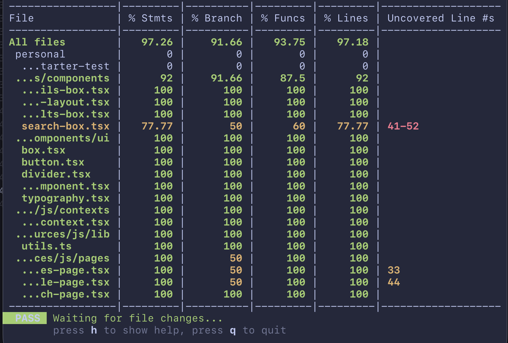
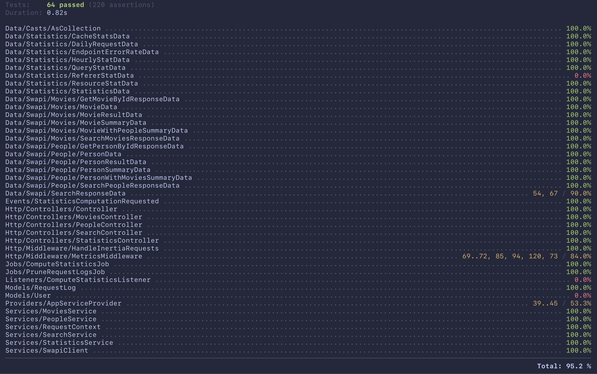

<div align="center">
  <h1>SWStarter</h1>
  <a href="https://github.com/ouwargui/starwars-lawnstarter-test/actions/workflows/lint.yml">
    
  </a>
  <a href="https://github.com/ouwargui/starwars-lawnstarter-test/actions/workflows/tests.yml">
    
  </a>
</div>

## Run the application

Follow these instructions to run the application on your machine.

### Requirements

- Docker
- Docker Compose

If you're on macOS I recommend [OrbStack](https://orbstack.dev/).

### Instructions

1. Clone the repository

```bash
git clone https://github.com/ouwargui/starwars-lawnstarter-test.git
```

2. Navigate to the project directory

```bash
cd starwars-lawnstarter-test
```

3. Build and run the application

```bash
docker compose up -d
```

4. Access the application

```bash
open http://localhost:8000
```

To stop the application, run:

```bash
docker compose down
```

## Routes

- `/`: Search page
- `/people/:id`: Person page
- `/movies/:id`: Movie page
- `/api/statistics`: Statistics endpoint

## Development environment

### Requirements

- PHP 8.5: https://laravel.com/docs/12.x/installation#installing-php
- Bun: https://bun.sh/docs/installation

### Instructions

1. Install PHP dependencies

```bash
composer install
```

2. Install Bun dependencies

```bash
bun install
```

## Tests

Tests are run automatically on every push to the repository.

If you wish to run locally, you'll need to setup the development environment.

### Frontend

To run the frontend tests, run:

```bash
bun run test:coverage
```



### Backend

To run the backend tests, run:

```bash
composer run test:coverage
```


